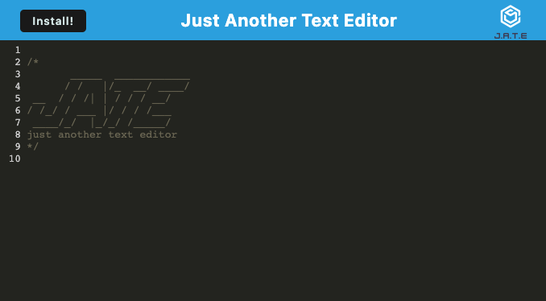
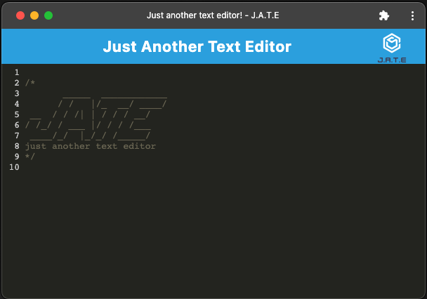

## J.A.T.E PWA text editor by Elibrer 


*This application can be used to write any text or code, both online and offline!*

[](https://developer.mozilla.org/en-US/docs/Web/JavaScript)  [](https://developer.mozilla.org/en-US/docs/Web/CSS) [](https://developer.mozilla.org/en-US/docs/Web/HTML)

---

## Packages used
[](https://nodejs.org/en/)  [](https://expressjs.com/) [](https://webpack.js.org/) [](https://babeljs.io/)

---

## Links
GitHub Repository: [@elibrer](https://github.com/elibrer/pwa-text-editor)

Link to deployed application: [@J.A.T.E](https://zweck-text-editor-226f3a8f722e.herokuapp.com/)

---

## Contributors
> Elijah Brereton @[GitHub](https://github.com/elibrer)

---

## Table of Contents
- [Description](#description)
- [Installation](#installation)
- [Features](#features)
- [Documentation](#documentation)
- [Application Preview](#application-preview)
- [License](#license)
- [Tests](#tests)
- [Questions](#questions)

---

## Description
This application is perfect for users who want to write code or text, both online and offline. Need to go away for the weekend without reception? Have a long flight planned with no WIFI access? This app will save all of the users data within the websites cache, so that it can be revisited even when offline!

---

## Installation
For usage of this application, visit the [J.A.T.E](https://zweck-text-editor-226f3a8f722e.herokuapp.com/) website via heroku. No further installation is required to access and operate the application. 

---

## Features
```
- GIVEN a text editor web application
- WHEN I open my application in my editor
- THEN I should see a client server folder structure
- WHEN I run `npm run start` from the root directory
- THEN I find that my application should start up the backend and serve the client
- WHEN I run the text editor application from my terminal
- THEN I find that my JavaScript files have been bundled using webpack
- WHEN I run my webpack plugins
- THEN I find that I have a generated HTML file, service worker, and a manifest file
- WHEN I use next-gen JavaScript in my application
- THEN I find that the text editor still functions in the browser without errors
- WHEN I open the text editor
- THEN I find that IndexedDB has immediately created a database storage
- WHEN I enter content and subsequently click off of the DOM window
- THEN I find that the content in the text editor has been saved with IndexedDB
- WHEN I reopen the text editor after closing it
- THEN I find that the content in the text editor has been retrieved from our IndexedDB
- WHEN I click on the Install button
- THEN I download my web application as an icon on my desktop
- WHEN I load my web application
- THEN I should have a registered service worker using workbox
- WHEN I register a service worker
- THEN I should have my static assets pre cached upon loading along with subsequent pages and static assets
- WHEN I deploy to Heroku
- THEN I should have proper build scripts for a webpack application
```

---

## Documentation
No documentation provided.

---

## Application Preview
### `Web page`

### `PWA Application`



---

## License
[Licensed under the MIT license.](https://opensource.org/licenses/MIT)

---

## Tests
To test, simply run the application by using the instructions provided above. If there are any errors, or the application did not work in the intended way, please try to locate and log the lines of code that bring up the error, and forward all issues to the email below.

---

## Questions
For questions and enquiries, please contact me at: 
[eli.brer@gmail.com](eli.brer@gmail.com)